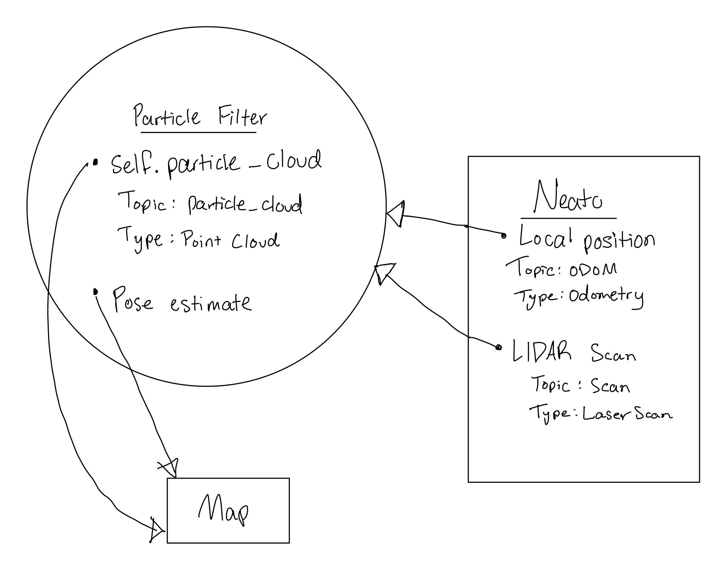

# Robot Localization Project

## Project Overview
The goal of this project is to use a particle filter system to determine the location of our Neato in the context of the world map. To do this, we used a combination of information from the Neato's laser scanner as well as the distance of our established particles and compared the distances to the obstacles around them to estimate the Neato's location in the map.

## Conceptual Breakdown

### Architecture Overview
We started by estabishing the topics our particles would subscribe and publish to, and indicated the role of each topic in the context of the particle filter.

<strong>Figure 1.</strong> Particle Filter Subscribers and Publishers.

### Initializing Particles
We initialized 300 particles in the world view. This number was given in the starter code and we decided it would be a good initial value.  This cloud of 300 particles was randomly scattered across our map using a normal distribution. This distribution randomly scatters the particles using a bell-shaped probability, where the particles occur less likely the further out it spreads from the center location. We chose to use a normal distribution simply because they are popular amongst data science models. 

Our particles are initialized into a map and given a small rotation based on a minimal range.

NOTE TO SELF: How big is the map? Also change the rotation here. 

#### Updating Particles with ODOM
After initializing our particle and moving our Neato away from its initial position, we needed to ensure all particles move correctly with the new position. We wanted the particles to each move relative to their local view in relation to the Neato's movement. First, we stored the change in x,y, and theta for our Neato. Next, we calculated each particles change in x,y, and theta using trigonometry. The following figure shows the particles transformation relative to it's initial placement:

$$
\Delta x = \Delta x_n * cos(\theta_p)
$$
$$
\Delta y = \Delta y_n * sin(\theta_p)
$$
$$
\Delta \theta = \theta_p + \theta_n
$$

<strong>Figure 2.</strong> Particle update equations.

<em>Subscripts denote: n = neato, p = particle.</em>

We looped through each particle making sure to add each change to the (x,y,theta) coordinates. After changing each particle in it's local view, the next step was to assign particle weights.

#### Assigning particle weights
To assign particle weights, we found the Neato's distance to the closest object, then found each particles distance to the closest object. We compared the distances of the particle to the nearest object and the neato's distance to the nearest object using delta d.

$$
\Delta d = abs (distance_p - distance_n)
$$

This equation assigns the strongest particles a value of 0, and the weakest particles a theoretical value of infinity (reasonably as large as the selected world map). This is a difficult and unintuitive scale to work with, so we adjusted the scale. Particles closest to 0 should have a weight of 10, while The general logic for normal cases uses the equation:

$$
p_w = max(0.1,min(10, \frac{1}{\Delta d}))
$$

In the unlikely case where the particle weight is exactly 0, the weight of the particle is assigned to 10 instead.

#### Normalizing and Resampling Particles
Normalizing particles is necessary for functions such as resampling particles, where the weights will be interpreted as probabilities. We normalized the particles by ensuring that the sum of all the weights is equal to 1. We simply calculated the total sum of particle weights in particle cloud, and divided each particle weight by the total sum.

NOTE TO SELF: ARE SOME PARTICLES RANDOMLY INITIALIZED? 

We collected the particle weights from each particle and used numpy.random to randomly choose from the list of particle weights. 300 new particles are chosen, and the probability of sampling each particle is proportional to its weight. Our filter focuses on the regions with the highest weights, and uses that to estimate the Neato's new pose.

## How to interact with our code
??? idk bro. 

## Team Member Contributions

### Grant
* Assigned the latest robot pose
* Modified particles using delta
* Normalized Particles
* Edited particle functions for different cases
* What we learned and challenges Writeup

### Tchenzie
* Created Particle_cloud
* Update Particles with Laser
* Conceptual Breakdown Writeup

## What We Learned and Challenges
### Challenges we faced along the way:
I think the biggest challenges to us overall were much more general, stemming partially from having the large set of starter code we did. It felt for a long while like we didn’t fully have an understanding of what we were actually doing. This got better as we looked into the starter code and talked with CAs, but the process from learning about the project to actually coding it took much longer than the previous project. Once we actually had an understanding of the code generally, the process wasn’t the most complex and expansive project since most of the portions we wrote were rather small, however we ran into more issues actually running it. Because of how so much of the code was already there it was hard to understand where a lot of our errors were. While we ended up getting it working (assuming we do), it took much more CA and teacher assistance than the first project.

### How we would improve with more time:
I think the biggest aspect we could work on improving is finding the robot pose from the particles. Since we felt we didn’t fully understand the whole process we opted for just averaging the positions of the most heavily weighted particles for our robot position. This doesn’t account for multiple clusters so it’s suboptimal. Having a solution for multiple clusters would be the best next option for a tangible improvement for the project.
Did you learn any interesting lessons for future robotic programming projects? These could relate to working on robotics projects in teams, working on more open-ended (and longer term) problems, or any other relevant topic.

### Valuable lesson
One valuable lesson that having the sample code did show us was the importance of separating projects into different parts and thinking about them one at a time. It helped us, once we started coding, to go through them in the order they were called and coding in a similar manner in the future could be extremely beneficial.
